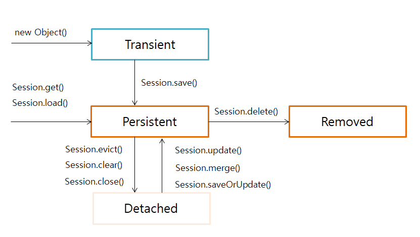

# 엔티티 생명주기

> Entity의 4가지 상태(Transient, Persistent, Detached, Removed)가 어떻게 전이되는지 Life cycle을 알아봅니다.




## 예제코드
> 스프링 데이터 JPA 강의의 예제코드를 참고했습니다.                     
> JPA에서 Hibernate API에 접근하는 방식으로 엔티티의 생명주기를 설명합니다. 

```java
@Component
@Transactional
public class JpaRunner implements ApplicationRunner{
	@PersistenceContext
	EntityManager entityManager;
	
	@Override
	public void run(ApplicationArguments args) throws Exception {
        Account account = new Account();
        account.setUsername("hyein");
        account.setPassword("jpa");
		
        Study study = new Study();
        study.setName("Spring Data JPA");
        
        Session session = entityManager.unwrap(Session.class);
        session.save(account);
        session.save(study);
	}
}
```

## 엔티티 상태
### 1. Transient (비영속)

```java
        Account account = new Account();
        account.setUsername("hyein");
        account.setPassword("jpa");
        
        Study study = new Study();
        study.setName("Spring Data JPA");
```

인스턴스를 생성했지만(`new Object()`) JPA는 아직 모르는 상태다. 영속화되서 DB에 반영될 수도 있고, 비영속 상태로 garbage될 수 있다.

### 2. Persistent (영속)

```java
        session.save(account);
        session.save(study);
```
Transient 상태의 인스턴스가 Session에 `save()`되면 이는 Session(영속성 컨텍스트)이 관리하는 인스턴스가 된다. 

> 참고 : 하나의 Session이 내부적으로 하나의 영속성 컨텍스트를 갖는다고 한다.

- **save()한 즉시 insert 쿼리가 발생하지 않는다** : Persistent 상태라는 말만 들으면 DB에 바로 insert해서 영속된다는 의미로 받아들여질 수 있다. 하지만 이는 영속성 컨텍스트에서 관리되고 있는(managed) 상태일뿐 DB에 반영되는 건 아니다. 특정 시점에 변경내용이 DB에 반영된다.

- 영속성 컨텍스트는 Persistent 상태의 인스턴스를 캐시에 저장한다. (1차 캐시)
- 영속성 컨텍스트는 인스턴스의 변경사항을 모니터링하고 있다. (Drity checking)

### 3. Detached (준영속)

```java
        session.evict(account); // session의 account 제거 
        session.clear(); // session의 모든 객체 제거 (초기화) 
        session.close(); // session을 닫는다 (종료)
```
위 메서드들이 실행되면 Persistent 상태의 인스턴스가 Session(영속성 컨텍스트)과 연결이 끊기게 되고 Detached 상태가 된다. Detached 상태는 영속성 컨텍스트가 관리하지는 않지만 다시 Session에 연결되서(재진입) 관리 대상이 될 수 있다.

>When the flush() method is called, the state of the entity is synchronized with the database. If you do not want this synchronization to occur, or if you are processing a huge number of objects and need to manage memory efficiently, **the evict() method can be used to remove the object and its collections from the first-level cache.**

### 4. Removed(삭제)

```java
        session.delete(account);
```
~~영속성 컨텍스트가 관리하긴 하지만 삭제하기로 한 상태다.~~ => 삭제된 상태
- **delete()한 즉시 delete 쿼리가 발생하지 않는다** : delete 역시 바로 delete되지 않는다. 특정 시점에 DB에 반영된다.


## 그렇다면 언제 변경내용이 DB에 반영이 될까? : 플러시
- `flush()` 직접 호출 
  - 테스트나 다른 프레임워크와 JPA를 함께 사용할 때를 제외하고 거의 사용하지 않는다. 
- 트랜잭션이 commit되기 전 `flush()` 자동 호출
  - DB에 변경내용을 SQL로 전달하지 않고 트랜잭션만 commit할 시 어떤 데이터도 DB에 반영되지 않는다. 때문에 트랜잭션을 commit하기 전 꼭 flush를 호출해서 Session(영속성 컨텍스트)의 변경내용을 DB에 반영해야 한다. 
- JPQL 쿼리 실행되기 전 `flush()` 자동 호출

단, flush()를 호출한다고 해서 영속성 컨텍스트를 비우는 건 아니다. flush가 호출된 시점에는 **영속성 컨텍스트의 변경 내용을 데이터베이스와 동기화**할 뿐이다.


## + Removed 정의에 대한 개인적인 오해

> Removed : 영속성 컨텍스트가 관리하긴 하지만 삭제하기로 한 상태

'영속성 컨텍스트가 관리하긴 하지만'이란 표현이 계속 의문이 들었다. delete 쿼리가 발생하기 전까지는 **영속성 컨텍스트가 해당 인스턴스를 가지고 있어서(관리하고 있어서)** 관리하고 있긴 하다고 표현을 했나? 그렇다면 delete 메서드가 호출된 순간 1차 캐시에는 Entity가 남아있는 걸까? 여러 글을 찾아봐도 시원한 답변을 얻지 못했다. 

그런데 다른 책에서는 Removed를 '삭제된 상태'라고 정의했고, 삭제 상태로 전이되는 메서드 호출시 해당 인스턴스는  **영속성 컨텍스트에서 제거**된다라고 적혀 있었다. 

- 스프링 데이터 JPA 강의
  - Removed : JPA(영속성 컨텍스트)가 관리하긴 하지만 삭제하기로 한 상태
    - Session의 delete(object) 호출 시 delete 쿼리가 즉시 발생하지 않는다.

- 자바 ORM 표준 JPA 프로그래밍 
  - Removed : 삭제된 상태. Entity를 영속성 컨텍스트와 데이터베이스에서 삭제한다.
    - Entity를 삭제하려면 먼저 삭제 대상 Entity를 조회해야 한다.
    - EntityManager의 remove(object) 호출시 object는 영속성 컨텍스트에서 제거된다.
    - DB에 즉시 삭제되는 것이 아니다. delete 쿼리는 SQL 저장소에 등록되어 특정 시점에 DB에 반영된다.

한 쪽은 Entity가 영속성 컨텍스트 관리 대상이긴 하다, 다른 쪽은 영속성 컨텍스트에서 제거된다고 말한다. 처음에는 이 상반된 해석이 Hibernate와 JPA의 차이인가 싶었는데 Hibernate의 레퍼런스를 찾아보니 정확하게는 이렇게 정의되어 있었다.

> the entity has an associated identifier and is associated with a persistence context, however, it is scheduled for removal from the database.

'Entity는 연관된 식별자가 있고, 영속성 컨텍스트와 연관되어 있지만 DB에서 제거되기로 예정되어 있다.'라고 해석하고 B의 설명을 결합하면 A,B가 상반된 해석을 한게 아니라 결국 같은 말을 하고 있다는 걸 알 수 있다.

- *Entity는 연관된 식별자가 있고, 영속성 컨텍스트와 연관된다*
  - 영속성 컨텍스트는 내부에 캐시가 있는데 식별자(key)와 Entity 인스턴스(value)가 있다. 
  - Entity를 삭제하려면 먼저 삭제 대상 Entity를 영속성 컨텍스트에서 조회한다.
  - 삭제 메서드를 호출해 조회한 Entity를 영속성 컨텍스트에서 삭제한다. (DB 삭제 x)

- *DB에서 제거하기로 예정되어 있다. (삭제 상태)*
  - delete 쿼리가 SQL 저장소에 있지만 아직 DB에 반영되지 않았다. 

정리하면 
 
1) **영속성 컨텍스트와 연관되어 있어야 영속성 컨텍스트에서 삭제 대상 Entity를 조회할 수 있다.** 
2) **조회한 Entity를 delete(Hibernate) 혹은 remove(JPA)하면 영속성 컨텍스트(1차 캐시)에서 해당 Entity는 삭제된다.** 그래서 Entity가 '영속성 컨텍스트의 관리 대상'이란 표현은 맞지 않다. 
3) 2번에서 삭제는 **영속성 컨텍스트에 있는 Entity가 삭제되는 것이지 DB에 있는 Entity가 즉시 삭제되는 것이 아니다.** **delete쿼리는 SQL 저장소에 등록되어 DB에 반영되어야 할 시점에 쿼리가 전달된다.**

# 참고자료
- [스프링 데이터 JPA](https://www.inflearn.com/course/%EC%8A%A4%ED%94%84%EB%A7%81-%EB%8D%B0%EC%9D%B4%ED%84%B0-jpa/dashboard)
- [JPA 객체를 활용한 개발](https://12bme.tistory.com/492)
- [Hibernate Docs](https://docs.jboss.org/hibernate/orm/5.4/userguide/html_single/Hibernate_User_Guide.html#_evicting_entities)
- [자바 ORM 표준 JPA 프로그래밍]()